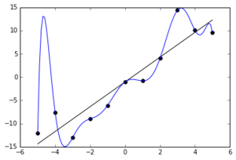

# Assessing the validity of a model

## Introduction

Broadly speaking, model selection is about choosing a model that best *fits* (on some sense) the available sample so that it can be used to understand the phenomenon under investigation. This also includes being able to predict future outcomes and to assess research hypotheses within the population.  

Therefore, to reach these objectives, the available information should be used for two important tasks:

* building the model (learning phase)
* assess its *out-of-sample validity*

The two tasks are interdependent since building the model, i.e. finding the most suitable one, is made by optimizing, in some sense, its out-of-sample validity. 

Out-of-sample validity is a crucial concept in model selection. Indeed, it allows to assess how the results of a statistical analysis (e.g. the selection of a model) will generalize to other outcomes, equivalently, to the population. Without out-of-sample validation, a selection procedure will necessarily tend to choose models that *overfit* the data, since they would be the best within the sample. In other words, when overfitting, a model describes random error or noise instead of the underlying relationship, leading to an excessively complex model (too many parameters relative to the number of observations) and consequently a poor predictive performance and a wrong representation of what happens in the population.


> Example of overfitting situation \
```{r}
# Taken from https://en.wikipedia.org/wiki/Overfitting.
# Noisy (roughly linear) data is fitted to a linear function and a polynomial function. 
# Although the polynomial function is a perfect fit, the linear function can be expected 
# to generalize better: if the two functions were used to extrapolate beyond the fit data, 
# the linear function would make better predictions. This is because the polynomial
# function it is too dependent on the data which contains sampling error. 
#

```


More formally, consider a random variable $Y$ distributed according to model $F_{\boldsymbol{\theta}}$, possibly conditionally on a set of fixed covariates $\mathbf{X}=[x_1 \ldots \, x_p]$. We observe a random sample $\mathbf{y} = (Y_i)_{i = 1, \ldots , n}$ supposedly generated from $F_{\boldsymbol{\theta}}$ together with a non-random $n\times p$ full rank matrix of predictors $\mathbf{X}$. Define the prediction function $\hat{\mathbf{y}}$ that depends on the considered model, for example $\hat{\mathbf{y}}=\hat{\boldsymbol{\beta}}\mathbf{y}$ for the linear regression model. The inferential task is to assess the accuracy of the prediction function, so that it can be compared to alternative prediction functions.

Quantifying the prediction error of a prediction function requires specification of a discrepancy $D$ between a prediction $\hat{\mathbf{y}}$ and the actual response $\mathbf{y}$. A natural choice is the mean squared error (mean residual squared error)
\begin{equation}  
D\left(\hat{\mathbf{y}},\mathbf{y}\right)=\frac{1}{n}\sum_{i=1}^nd\left(\hat{y}_i,y_i\right)=\frac{1}{n}\sum_{i=1}^n\left(\hat{y}_i-y_i\right)^2
\end{equation}
However, in order to avoid overfitting situations for out-of-sample validity, what is actually sought is the *true prediction error*, i.e. the (mathematically) expected discrepancy between prediction function out-of-sample $\hat{y}_0$ and the corresponding out-of-sample realization $y_0$, namely
\begin{equation}  
\text{Err}=\mathbb{E}_{0}\left[d\left(\hat{Y}_0,Y_0\right)\right]
\end{equation}
where $\mathbb{E}_{0}$ denotes the expectation at the *out-of-sample* distribution. This quantity needs to be estimated in some manner with the sample at hand, hence the real challenge in model selction is 
- the specification of an out-of-sample validity measure, called a model selection criterion
- estimators for model selection criteria
- performance measures to compare different model selection criteria

In the following sections we present several methods for model selection and measures for out-of-sample validity.

> Exercice (optional): \
- Consider the Malnutrition in Zambia dataset (without interections). As model fit assesment consider a) the residual variance and b) the R^2. Starting from the full model (without interactions), increase progressively model size by including polynomials (on the continuous variables) and observe the behavior of the model fit criteria (using e.g. a plot). \ 

> Additional material: \
> Controlling for out-of-sample validity follows the lines of the scientific approach, in particular Occam's razor problem-solving principle (<https://en.wikipedia.org/wiki/Occam's_razor>). \
> One can intuitively understand overfitting from the fact that information from all past experience can be divided into two groups: information that is relevant for the future *("signal")* and irrelevant information *("noise")*. \
> Everything else being equal, the more difficult a criterion is to predict (i.e., the higher its uncertainty), the more noise existing in past information needs to be ignored. The problem is to determine which part to ignore. See <https://en.wikipedia.org/wiki/Overfitting>.\

## Cross-Validation

The challenge is now to find a suitable estimator for $\text{Err}$ with the help of the sample and the (assumed) model $F_{\boldsymbol{\theta}}$.  A first guess is the apparent error 
\begin{equation}  
\text{err}= \frac{1}{n}\sum_{i=1}^nd\left(\hat{y}_i,y_i\right)
\end{equation}
Unfortunatelly err usually underestimates Err since $\hat{y}_i$ has been adjusted to fit the observed responses $y_i$ (*trainig set*). 

Ideally, one should have an independent *validation set* (or *test set*)  of say $n^{\star}$ additional observations $y_{0i}, i=1,\ldots,n^{\star}$, so that one could estimate Err using
\begin{equation}  
\widehat{\text{Err}}_{\text{val}}= \frac{1}{n^{\star}}\sum_{i=1}^{n^{\star}}d\left(\hat{y}_{0i},y_{0i}\right)
\end{equation}
Cross-validation attempts to mimic $\widehat{\text{Err}}_{\text{val}}$ without the need for a validation set. Define $\hat{y}_{(i)}$ to be the predicted value compute on the reduced training set in which the $i$th observation 
has been omitted. The the *leave one out* cross-validation estimate of prediction error is
\begin{equation}  
\widehat{\text{Err}}_{\text{cv1}}= \frac{1}{n}\sum_{i=1}^{n}d\left(\hat{y}_{(i)},y_{i}\right)
\end{equation}
A more common practice is to leave out several observations at a time: the sample is randomly partitioned into $J$ groups of size about $\lfloor n/J\rfloor=n_J$ each, then for each $j=1,\ldots,J$ groups, the training set is the sample without the $j$th group on which the prediction $\hat{y}_{(j)}$ is computed and then compared to the observations in the $j$th group $y_j$ using the chosen discrepancy measure $D$. A common choice is $J=10$ leading to the *ten-fold cross-validation* procedure. Reducing from $n$ to $J$ the number of training and validation sets reduces the necessary number of prediction rules constructions (estimation). The optimal value for $J$ is however not known.

> Exercise: \
> - Program k-fold Cross-Validation (with k=2) and do model selection in a specific simulation setting with an exhaustive search. Follow these steps:\
> (a) Generate from a MVN (multivariate normal) a matrix $\mathbf{X_{n*p}}$ with $n = 1000$ and $p = 5$. You can choose the location vector as you wish but set the scale matrix as the identity.\
> (b) Choose the generating vector $\boldsymbol{\beta }= [3 \; 1.5 \; 0 \; 2 \; 0]$ and retrieve the signal to noise ratio of this setting.\
> (c) Generate $\hat{\mathbf{y}}$ thanks to the relation $\mathbf{y} =  \mathbf{X_{n*p}} \; \boldsymbol{\beta} + \boldsymbol{\epsilon}$ where $\epsilon_{i}$ is a standard normal, $n = 1000$ and $p = 5$. Suppose for simplicity that the errors are uncorrelated. \
> (d) Split the data randomly in two halves (k=2) and use the training set to determine $\hat{\boldsymbol{\beta}}$. Then, compute the squared loss function as prediction error measure for each possible model. Observe which model is the best model.\
> (e) Suppose now that we increase the size of $\boldsymbol{\beta}$ to 100 (i.e. $p = 100$ ). Calculate the number of possible models to evaluate together with an estimate of the time needed for an exhaustive search (*hint: use previous results*). Conclude on the feasibility of this task.    


## Covariance Penalties Criteria

### Introduction

Originally, the covariance penalty approach treats prediction error estimation in
a regression framework, with the predictors $\mathbf{X}$ considered as fixed. Moreover, supposing for the moment that the discrepancy measure is the squared difference (or $L_2$ norm), the *true* prediction error (conditionnally on $\mathbf{x}_i$) is defined as
\begin{equation}  
\text{Err}_i=\mathbb{E}_{0}\left[\left(\hat{Y}_i-Y_0\right)^2\right]
\end{equation}
The overall prediction error is $\text{Err}=1/n\sum_{i=1}^n\text{Err}_i$. 

The question is how to estimate this quantity, given a sample and a data generating model? [@efron2004estimation] uses $\mathbb{E}\left[\text{Err}_i\right]$ (where $\mathbb{E}$ denotes the expectation at the *insample* distribution) and shows that
\begin{equation}  
\mathbb{E}\left[\text{Err}_i\right]=
\mathbb{E}\left[\text{err}_i\right]+2\text{cov}\left(\hat{Y}_i;Y_i\right)
\end{equation}
with $\mathbb{E}\left[\text{err}_i\right]= \left(\hat{y}_i-y_i\right)^2$, the apparent (or in-sample) error.
This result says that, on average, the apparent error $\text{err}_i$ understimates the true prediction error $\text{Err}_i$ by the covariance penalty $2\text{cov}\left(\hat{Y}_i;Y_i\right)$. This
makes intuitive sense since $\text{cov}\left(\hat{Y}_i;Y_i\right)$ measures the amount by which $y_i$ influences its own prediction $\hat{y}_i$. An natural estimator for the overall predition error is then given by
\begin{equation}  
\widehat{\text{Err}}=
\frac{1}{n}\sum_{i=1}^n\left(\hat{y}_i-y_i\right)^2+\frac{2}{n}\sum_{i=1}^n\widehat{\text{cov}}\left(\hat{Y}_i;Y_i\right)
\end{equation}

Depending on the assumed model, $\widehat{\text{cov}}\left(\hat{Y}_i;Y_i\right)$ is obtained analytically up to a value of $\boldsymbol{\theta}$, the model's parameters, which is then replaced by $\hat{\boldsymbol{\theta}}$ (plug-in method), or by resampling methods such as the parametric bootstrap. For the later, considering the model $F_{\boldsymbol{\theta}}$, one uses the following steps:

1. Estimate $\boldsymbol{\theta}$ from $F^{(n)}$ to get $\hat{\boldsymbol{\theta}}$.\
2. Set the seed\
3. For $j=1,\ldots,B$, do\
 a. Simulate $n$ values $y_i^{(j)}, i=1,\ldots,n$ from $F_{\hat{\boldsymbol{\theta}}}$,\
b. Compute $\hat{y}_i^{(j)}, i=1,\ldots,n$, possibly conditionally on the matrix of predictors $\mathbf{X}$\
4. Compute $\forall i$ 
\begin{equation}  
\widehat{\text{cov}}\left(\hat{Y}_i;Y_i\right)=1/B\sum_{j=1}^B\left(\hat{y}_i^{(j)}-\hat{y}_i^{(j\cdot)}\right)\left(y_i^{(j)}-y_i^{(j\cdot)}\right)
\end{equation}
with $\hat{y}_i^{(j\cdot)}=1/n\sum_{j=1}^B\hat{y}_i^{(j)}$ and $y_i^{(j\cdot)}=1/n\sum_{j=1}^By_i^{(j)}$

> Exercise (optional): \
> Consider the simulation setting of the exercise in the previous Section. \
> - Instead of splitting the sample in two halves, compute the covariance prenalized predition error, with covariance penalty estimated via simulations (using the proposed algorithm).\
> - Compare the analysis (decison) with the one obtained by means of cross-validation (in the previous exercise).

  
### Mallows $C_p$

Consider the linear regression model $Y_i|\mathbf{x}_i \sim \mathcal{N}(\boldsymbol{\mu}\left(\mathbf{x}_i\right),\sigma^2), 0<\sigma^2<\infty$, with 
\begin{equation}  
\boldsymbol{\mu}\left(\mathbf{x}_i\right)=\mathbf{x}_i^T \boldsymbol{\beta}, 
\end{equation}
where $\boldsymbol{\beta} \in  \mathbb{R}^p$ and $\mathbf{x}_i^T$ is the *i*th row of $\mathbf{X}$ (that includes a column of ones for the intercept). One notable result (see exercise below) that can be deduced from the covariance penalty formula, for the linear regression model using the least squares estimator (LSE) $\hat{\beta}=\left(\mathbf{X}^T\mathbf{X}\right)^{-1}\mathbf{X}^T\mathbf{y}$, $\mathbf{y}=[y_1,\ldots,y_n]^T$, is Mallow's  $C_p$[^6] [@Mall:73]:
\begin{equation}  
C_p=\frac{1}{n}\sum_{i=1}^n\left(\hat{y}_i-y_i\right)^2+\frac{2}{n}p\sigma^2
\end{equation}

[^6]: Mallows $C_p$ is originally defined as $C_p=\frac{1}{n}\sum_{i=1}^n\frac{\left(\hat{y}_i-y_i\right)^2}{\sigma^2}+\frac{2}{n}p$, which provides the same information when comparing models.


> Exercise: derive Mallow's $C_p$ from the general estimator $\widehat{\text{Err}}$.

> Exercise (optional): \
> Consider a Linear Mixed Model (LMM), for example the electrode resistance data, estimated using the generalized least squares (GLS) estimator. \
> - Derive and/or estimate $\widehat{\text{Err}}$. Hint: write the model with a vector of stacked responses and, consequently, a non-diagonal residual error (co)variance. \

### Efron's $q$-class

Covariance penalties can be applied to measures of prediction error other
than squared error, like the Kullback - Leibler divergence. Then, to derive $\widehat{\text{Err}}$, one needs a more general expression for $\mathbb{E}\left[\text{Err}_i\right]$. @efron1986biased uses a function $Q(\cdot,\cdot)$ based on the $q$-class error measure between two scalar functions $u$ and $v$, given by 
\begin{equation}  
	Q(u,v) = q(v) + \dot{q}(v) (u - v) - q(u)
\end{equation}
where $\dot{q}(v)$ is the derivative of $q( \cdot )$ evaluated at $v$. For example $q(v) = v(1-v)$ gives the squared loss function $Q(u,v) = (u - v)^2$ and $q(v)=\min\{v,(1-v)\}$ leads to the missclassification loss $Q(u,v)=I\{u\neq I(u>1/2)\}$, where $I(\cdot)$ denotes the indicator function. Efron's optimism Theorem [@efron2004estimation] demonstrates that
\begin{equation*} 
	\text{Err}_i = \mathbb{E} \left[ \mathbb{E}_0 \left[ Q(Y^0_i,\hat{Y}_i) | \mathbf{y}\right] \right] =\mathbb{E} \left[ Q(Y_i,\hat{Y}_i) + \Omega_i \right] 
	\label{eq:optimismTHM}
\end{equation*}
with $\Omega_i = \text{cov} \left( \dot{q}(\hat{Y}_i),Y_i \right)$. Hence, an estimator of $\text{Err}$ is obtained as
\begin{equation} 
		\widehat{\text{Err}} = \frac{1}{n} \sum_{i = 1}^{n}\left( Q(y_i,\hat{y}_i) + \widehat{\text{cov}} \left( \dot{q}(\hat{Y}_i),Y_i \right)\right)
\end{equation}


## Information Theory and Bayesian Criteria 


### AIC: Akaike Information Criterion

The AIC is derived from *Information Theory* which concerns the quantification, storage, and communication of information (@Shan:48a,@Shan:48b). Associated measures are applied to distributions of random variables and include the *entropy* measure for a single random variable. A derived measure for two random variables is the *Kullback-Leibler divergence* (or information divergence, information gain, or relative entropy). 

Consider two densities $f_0$ and $f_1$, the Kullback–Leibler divergence is 
\begin{equation}  
D\left(f_0,f_1\right)=2\int f_0(y) \log\left(\frac{f_0(y)}{f_1(y)}\right)dy =
2\mathbb{E}_0\left[\log\left(\frac{f_0(y)}{f_1(y)}\right)\right]
\end{equation}
 
The Kullback-Leibler divergence can be used to evaluate the adequacy of a model, by considering e.g. $f_1:=f(y;\hat{\boldsymbol{\theta}})$, the fitted density corresponding to model $F_{\boldsymbol{\theta}}$. In that case, the *true* prediction error becomes a  *deviance* given by
\begin{equation}  
\text{Err}_i=2\mathbb{E}_0\left[\log\left(\frac{f_0(y)}{f(y_i;\hat{\boldsymbol{\theta}})}\right)\right]
\end{equation}
with total deviance $1/n\sum_{i=1}^n \text{Err}_i$. Akaike [@Akai:74] proposed to consider, as a model adequacy measure, an estimator of
\begin{equation}  
2\mathbb{E}_0\left[\mathbb{E}\left[\log\left(f_0(y)\right)-\log\left(f(y;\hat{\boldsymbol{\theta}})\right)\right]\right]
\end{equation}
where $\mathbb{E}$ denotes the expectation at the *insample* distribution. Akaike derived the estimator
\begin{equation} 

-2\sum_{i=1}^n \log f(\hat{y}_i;\hat{\boldsymbol{\theta}})+2p + \text{const.}
\end{equation}
where $\text{const.}$ does not depend on the model and hence can be ommitted when comparing models. For the linear regression model with $\hat{\boldsymbol{\mu}}=\mathbf{x}^T \hat{\boldsymbol{\beta}}$, supposing $\sigma^2$ known (and ommitting the constant term), we have 
\begin{equation} 

\frac{1}{\sigma^2}\sum_{i=1}^n \left(y_i-\mathbf{x}_i^T \hat{\boldsymbol{\beta}}\right)^2+2p 
\end{equation}
There exist several expressions for the AIC for the linear regression model, one of them being
\begin{equation} 

\text{AIC}=  \frac{1}{n\sigma^2} \text{RSS}+\frac{2}{n}p 
\end{equation}
where $\text{RSS}=\sum_{i=1}^n\left(y_i-\mathbf{x}_i^T \hat{\boldsymbol{\beta}}\right)^2$ is the residual sum-of-squares. We can see that $C_p=\sigma^2\text{AIC}$

> Exercise:
> - Derive the AIC for the regression model from its more general definition.\
> - Program AIC and do model selection in a specific simulation setting with an exhaustive search (follow the passages listed in the CV exercise section).\
> - Compare the performance of your programmed CV and AIC by replicating 100 times the tasks. In particular you should evaluate three specific criteria: the proportion of times the correct model is selected (*Exact*), the proportion of times the selected model contains the correct one (*Correct*) and the average number of selected regressors (*Average $\sharp$*)\
> - Load the [wine dataset](https://archive.ics.uci.edu/ml/machine-learning-databases/wine/wine.data) from the UCI repository and perform an exhaustive search based on CV and AIC in order to find the best model. You can either employ your codes derived in previous exercises or make use of the existing R packages: *leaps*, *glmulti*, *MuMIn* and *caret*. \


> Exercise (optional): \
> Using the general result on covariance penalty measures based on Efron's $q$-class, show that the AIC is a suitable estimator of the prediction error.


### BIC: Bayesian Information Criterion

[@Schw:78] derived the Bayesian information criterion as
\begin{equation} 
\text{BIC} = -\sum_{i=1}^n \log f(\hat{y}_i;\hat{\boldsymbol{\mu}},\hat{\sigma}^2)+p\log(n) + \text{const.}
\end{equation}
where $\text{const.}$ does not depend on the model and hence can be ommitted when comparing models. The BIC is derived from Bayesian inference arguments, but is not related to information theory. Compared to the AIC (or indeed the $C_p$), the BIC uses $p\log(n)$ istead of $2p$ as an estimated penalty and since $\log(n)> 2$ for any $n > 7$, the BIC statistic generally places a heavier penalty on models with many variables, and hence results in the selection of smaller models than AIC.

## Mean Squared Error Based Criteria

### Stein's unbiased risk estimator (SURE)

The SURE can in principle by used to compare models. A standard application of SURE is in shrinkage estimators (see Section ????). [@Stei:81] derived  an unbiased estimator of the mean-squared error showing that $\mathbb{E}\left[Zf(Z)\right]=\mathbb{E}\left[f^{'}(Z)\right]$ for $Z\sim N(0,1)$. Putting $Y_i\sim N(\mu_i,\sigma^2)$ and $\hat{Y}_i=\hat{\mu}(Y_i)$ we get 
\begin{equation}
 
\mathbb{E}\left[(Y_i-\mu_i)\hat{\mu}(Y_i)\right]=\text{cov}\left[Y_i,\hat{Y}_i\right]=\sigma^2\mathbb{E}\left[\partial\hat{\mu}(Y_i)/\partial Y_i\right]
\end{equation}
The SURE is an unbiased estimator of $\mathbb{E}\left[\vert\vert \mu-\hat{\mu}\vert\vert_2^2\right]$, given by 
\begin{equation}

\text{SURE}=-n\sigma^2+\sum_{i=1}^n\left(\hat{y}_i-y_i\right)^2+2\sigma^2\sum_{i=1}^n \partial\hat{\mu}(y_i)/\partial y_i
\end{equation}
Note that SURE is not equal to the $C_p$.

> Exercise: show that (1) $\text{cov} \left(\hat{Y}_i;Y_i\right)=\sigma^2\mathbb{E}\left[\partial\hat{Y}_i/\partial Y_i\right]$ and (2)  an unbiased estimator of $\mathbb{E}\left[\vert\vert \mu-\hat{\mu}\vert\vert_2^2\right]$ is given by (????) 


### The Focused Information Criterion (FIC)

The FIC in its original format (see [@ClHj:03]) interprets *best* model in
the sense of *minimizing the mean squared error* (MSE) of the
estimator of the quantity of interest.  The FIC philosophy puts less emphasis on which variables are in the model but rather on the accuracy of the
estimator of a focus. 

To build the FIC, one considers a model of the form $F_{\nu, \gamma}$, with density $f(\cdot;\nu,\gamma)$, with $\nu \in \mathbb{R}^p$ not subject to model selection (i.e. included in all considered models), $\gamma \in \mathbb{R}^q$ the parameters on which model selection is performed. $\gamma$ and $q$ are allowed to depend on the sample size $n$, hence $\gamma:= \gamma_{n}$ and $q:= q_n$. For the linear regression model $Y_i|\mathbf{x}_i \sim \mathcal{N}(\beta_0+\mathbf{x}_i\beta,\sigma^2)$(with $\mathbf{x}_i$ not containing the one in the first column), a natural choice  is $\nu = (\beta_0,\sigma^2)$ and $\gamma_n = \beta$. The focus, or quantity of interest, is $\hat{\mu}:=\mu(\nu,\gamma_n)$, which can be, but not necessarily, the prediction for one particular new observation. Given a (chosen) estimator for the focus, $\mu(\hat{\nu},\hat{\gamma_n})$, assuming $\gamma_n= \gamma + \delta/\sqrt{n}$ and considering a fixed value $q$, [@ClHj:03] use a taylor expansion of $\sqrt{n}\left(\hat{\mu}-\mu\right)$ to derive the bias and variance to build the (first order) MSE.

More specifically, consider the set of indices $S\subseteq \left\{1,\ldots,q\right\}$such that $\gamma_S\subseteq \gamma$is the corresponding subset of parameters, hence forming a submodel $S$ of $F_{\nu,\gamma}$, one gets
\begin{equation}

\sqrt{n}\left(\hat{\mu}_S-\mu\right)\approx \left[\frac{\partial\mu(\nu,\gamma)}{\partial\nu}\right]^T\sqrt{n}\left(\hat{\nu}-\nu\right)+\left[\frac{\partial\mu(\nu,\gamma)}{\partial\gamma_S}\right]^T\sqrt{n}\left(\hat{\gamma}_S-\gamma\right)\delta
\end{equation}
To derive the MSE, [@ClHj:03] use the asymptotic distribution of $\sqrt{n}\left(\hat{\mu}_S-\mu\right)$ which, in the case of the MLE, assuming the correct model is $S$ is
For the linear regression model, [@ClHj:03] show that the MSE is then given by
\begin{equation}

\mbox{MSE}_S=\ldots
\end{equation}


## Classification measures

Sensitivity: probability of predicting disease given true state is disease.

Specificity: probability of predicting non-disease given true state is non-
disease.

- ROC curves: <https://en.wikipedia.org/wiki/Receiver_operating_characteristic>


The receiver operating characteristic curve (ROC) is a commonly used summary
for assessing the tradeoff between sensitivity and specificity. It is a plot of
the sensitivity versus specificity as we vary the parameters of a classification
rule.

The area under the ROC is a commonly used quantitative summary measure. It is sometimes called the *c*-statistic. However, for evaluating the contribution of an additional predictor when added to a standard model, the *c*-statistic may not be an informative measure. The new predictor can be very significant in terms
of the change in model deviance, but show only a small increase in the *c*-
statistic (see [@HaTiFr:09]). 


## Generalized measures

Deviance based criteria and others

